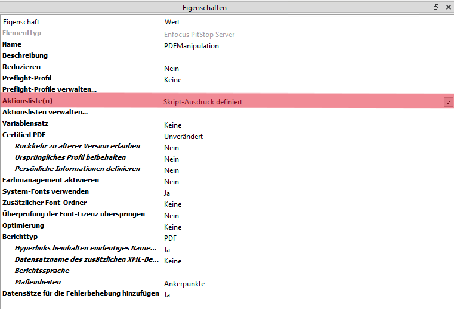

# Script for Enfocus Switch - PitStop Server
**Instructions for Defining Multiple Action Lists in PitStop Server Flow Element**

------

## Overview
This script allows you to define multiple action lists in the Enfocus PitStop Server flow element via a script. Each action list must be properly referenced, including its full path and file extension.

## Key Information
When defining multiple action lists via a script, each action list must be placed on a separate line. The script's output should be a string where each action list is followed by a line break. Make sure to provide the complete file path for each action list, including the '.eal' suffix.

------

## Requirements

* Enfocus Switch 2024 Spring
* Enfocus Pitstop Server 24

## Step-by-Step Instructions

1. Open the properties of the PitStop Server flow element in Enfocus Switch.
2. Under **Action List**, select the option **'Define script expression'**.
2. 
3. Paste the script into the appropriate field and replace the placeholders in the [] tags with the correct variable values.